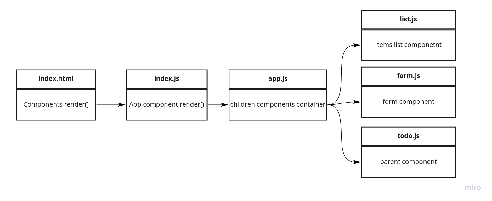

# React hooks

[Lab 31](https://github.com/ahmadkheder-401-advanced-javascript/todo/pull/1)

## About this repostory

In this initial phase, we’re going to have to start by converting a legacy application into a more modern architecture. Our initial “Proof of Concept” was written using class based components and was not properly styled. Now that our client has given us the “green light” for development, we’re going to refactor the application using Hooks and upgrading the style.

## Features

Number and name of feature: Notes
Estimate of time needed to complete: 2 hours
Start time: 20:0
Finish time: 02:0
Actual time needed to complete: 4 hours

## Date published

date: Mon 19 Oct 2020

## author

Ahmad Kheder

## Contact

linkedIn: <https://www.linkedin.com/in/ahmad-abdulatef-121066181>

## UML

Link to an image of the UML for your application and response to events

lab 31 :

